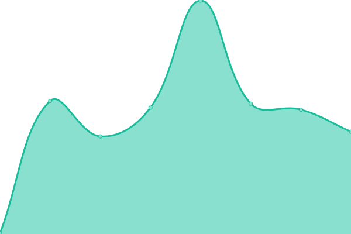
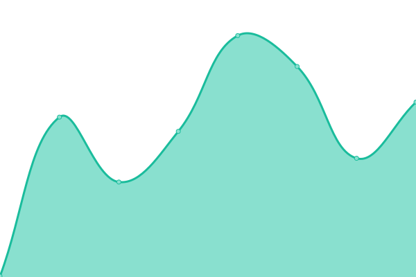

# [📈 Live Status](https://teamgreyfinch.github.io/public-status): <!--live status--> **🟩 All systems operational**

This repository contains the open-source uptime monitor and status page for [Greyfinch](https://greyfinch.com), powered by [Upptime](https://github.com/upptime/upptime).

With [Upptime](https://upptime.js.org), you can get your own unlimited and free uptime monitor and status page, powered entirely by a GitHub repository. We use [Issues](https://github.com/teamgreyfinch/public-status/issues) as incident reports, [Actions](https://github.com/teamgreyfinch/public-status/actions) as uptime monitors, and [Pages](https://teamgreyfinch.github.io/public-status) for the status page.

<!--start: status pages-->
<!-- This summary is generated by Upptime (https://github.com/upptime/upptime) -->
<!-- Do not edit this manually, your changes will be overwritten -->
<!-- prettier-ignore -->
| URL | Status | History | Response Time | Uptime |
| --- | ------ | ------- | ------------- | ------ |
|  [PMS App - https://admin.greyfinch.com/](https://admin.greyfinch.com/) | 🟩 Up | [pms-app-https-admin-greyfinch-com.yml](https://github.com/teamgreyfinch/public-status/commits/HEAD/history/pms-app-https-admin-greyfinch-com.yml) | 

 273ms
     
 | 

<a href="https://teamgreyfinch.github.io/public-status/history/pms-app-https-admin-greyfinch-com">100.00%</a>
    

|  [My Smile Hub - https://hub.greyfinch.com/](https://hub.greyfinch.com/) | 🟩 Up | [my-smile-hub-https-hub-greyfinch-com.yml](https://github.com/teamgreyfinch/public-status/commits/HEAD/history/my-smile-hub-https-hub-greyfinch-com.yml) | 

 245ms
     
 | 

<a href="https://teamgreyfinch.github.io/public-status/history/my-smile-hub-https-hub-greyfinch-com">100.00%</a>
    

|  [Appointments Widget](https://appointments.greyfinch.com/?division=981581) | 🟩 Up | [appointments-widget.yml](https://github.com/teamgreyfinch/public-status/commits/HEAD/history/appointments-widget.yml) | 

 286ms
     
 | 

<a href="https://teamgreyfinch.github.io/public-status/history/appointments-widget">100.00%</a>
    

|  [API - https://api.greyfinch.com/](https://api.greyfinch.com/healthz) | 🟩 Up | [api-https-api-greyfinch-com.yml](https://github.com/teamgreyfinch/public-status/commits/HEAD/history/api-https-api-greyfinch-com.yml) | 

 499ms
     
 | 

<a href="https://teamgreyfinch.github.io/public-status/history/api-https-api-greyfinch-com">100.00%</a>
    

|  [Website - https://greyfinch.com/](https://greyfinch.com/) | 🟩 Up | [website-https-greyfinch-com.yml](https://github.com/teamgreyfinch/public-status/commits/HEAD/history/website-https-greyfinch-com.yml) | 

 405ms
     
 | 

<a href="https://teamgreyfinch.github.io/public-status/history/website-https-greyfinch-com">100.00%</a>
    

<!--end: status pages-->

[**Visit our status website →**](https://teamgreyfinch.github.io/public-status)

## 📄 License

- Powered by: [Upptime](https://github.com/upptime/upptime)
- Code: [MIT](./LICENSE) © [Greyfinch](https://greyfinch.com)
- Data in the `./history` directory: [Open Database License](https://opendatacommons.org/licenses/odbl/1-0/)
